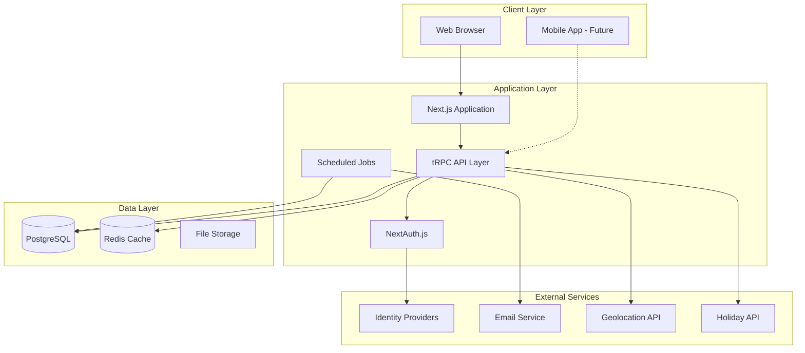
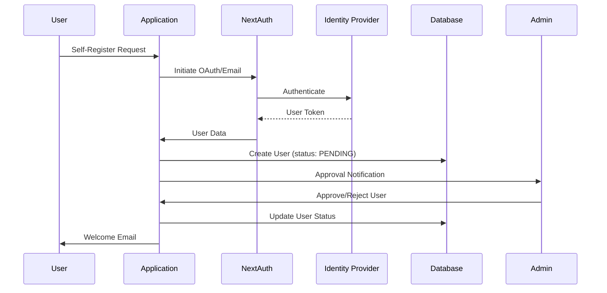
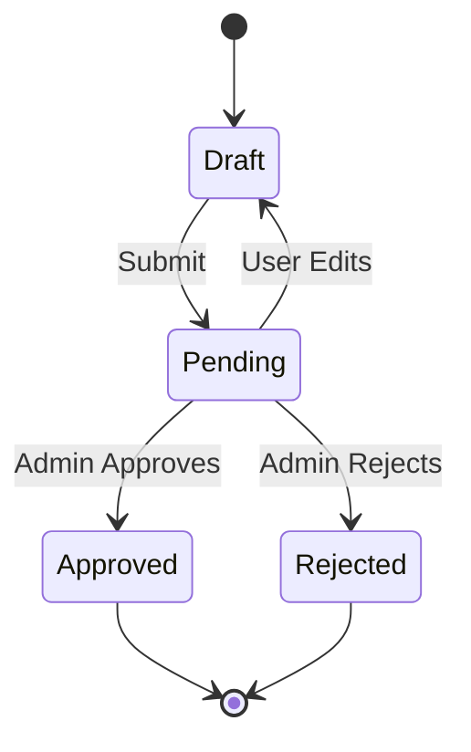
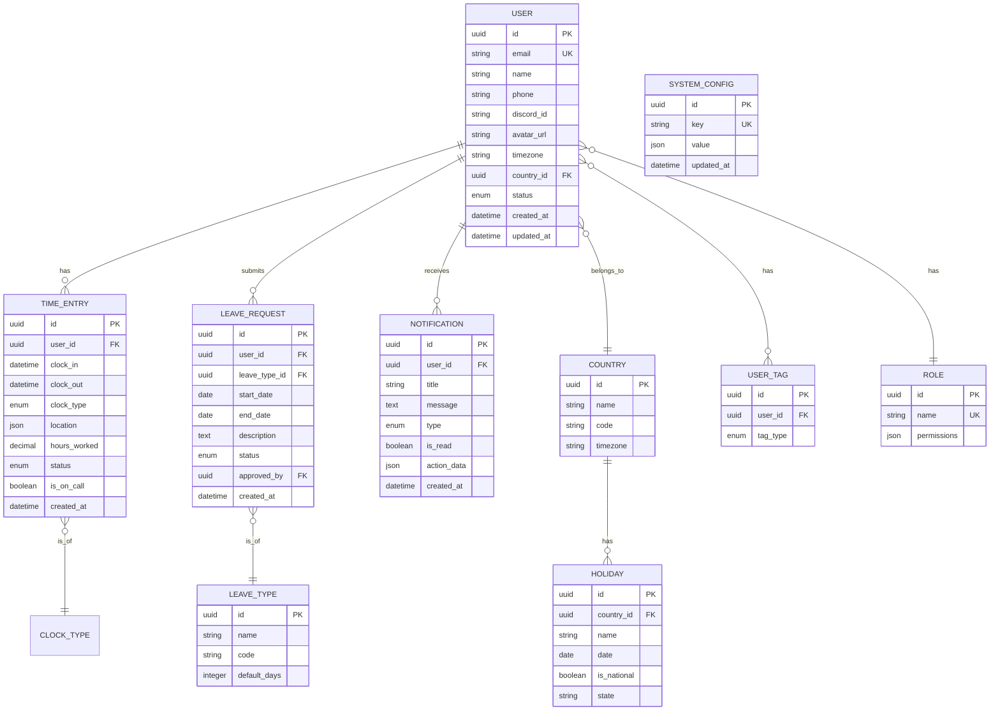

# HR Time & Attendance Management System
## Comprehensive Planning Document

---

## 1. Executive Summary

A modern web-based HR application for managing employee time tracking, attendance, holiday management, and workforce analytics. The system supports multiple user roles, flexible clock-in/out mechanisms, automated notifications, and comprehensive reporting capabilities.

### Key Objectives
- **Real-time Time Tracking**: In-office and remote clock-in with location capture
- **Intelligent Notifications**: Timezone-aware reminders and overtime alerts
- **Holiday Management**: Country-specific holiday calendars with leave request workflow
- **Comprehensive Analytics**: Visual dashboards with exportable reports
- **GDPR Compliance**: Privacy-first design with data protection controls

---

## 2. Technology Architecture

### 2.1 Tech Stack Selection

| Layer | Technology | Rationale |
|-------|------------|-----------|
| **Frontend** | Next.js 14 (App Router) | SSR, excellent DX, built-in API routes |
| **UI Components** | shadcn/ui + Tailwind CSS | Accessible, customizable, modern |
| **State Management** | Zustand + React Query | Lightweight, excellent caching |
| **Backend** | Next.js API Routes + tRPC | Type-safe, integrated with frontend |
| **Database** | PostgreSQL (Supabase) | ACID compliant, excellent for relational data |
| **ORM** | Prisma | Type-safe, great migration support |
| **Authentication** | NextAuth.js v5 | Multi-provider IDP support |
| **Email** | Resend | Modern, developer-friendly |
| **Notifications** | Knock.io / Custom WebSocket | Real-time + scheduled |
| **Charts** | Recharts / Chart.js | Responsive, export-ready |
| **Export** | SheetJS (xlsx) | Excel/CSV generation |
| **Scheduling** | Vercel Cron / node-cron | Automated tasks |
| **Hosting** | Vercel | Seamless Next.js deployment |

### 2.2 System Architecture Diagram



### 2.3 Authentication Flow



---

## 3. Feature Specifications

### 3.1 User Management

#### Roles
| Role | Permissions |
|------|-------------|
| **Super Admin** | Full system access, user management, configurations |
| **Admin** | Manage users, approve requests, view all reports |
| **Manager** | View team reports, approve team leave requests |
| **Developer** | Standard user access with clock in/out |
| **Intern** | Standard user access, limited history |

#### User Tags (Non-exclusive)
- `REMOTE` - Remote worker
- `HYBRID` - Hybrid schedule
- `INTERN` - Internship position
- `ON_CALL` - Available for weekend/holiday work

#### User Profile Fields
| Field | Type | Required | Notes |
|-------|------|----------|-------|
| Full Name | String | ✓ | |
| Email (Work) | Email | ✓ | Verified on registration |
| Phone Number | String | ✓ | With country code |
| Discord ID | String | ✗ | For team communication |
| Profile Photo | File | ✗ | Avatar upload |
| Timezone | Select | ✓ | Admin configurable |
| Country | Select | ✓ | For holiday calendar |
| Department | String | ✗ | |
| Join Date | Date | ✓ | Auto-set |
| Role | Select | ✓ | Admin-assigned |
| Tags | Multi-select | ✗ | Admin-assigned |

### 3.2 Time Tracking System

#### Clock-In/Out Features
```
┌─────────────────────────────────────────────────────────┐
│                    CLOCK IN FLOW                        │
├─────────────────────────────────────────────────────────┤
│  1. User clicks "Clock In" button                       │
│  2. System shows dropdown: [In Office] [Remote]         │
│  3. If Remote → Capture GPS location (with consent)     │
│  4. Record timestamp + type + location                  │
│  5. Update user status to "WORKING"                     │
│  6. Start tracking timer                                │
└─────────────────────────────────────────────────────────┘

┌─────────────────────────────────────────────────────────┐
│                    CLOCK OUT FLOW                       │
├─────────────────────────────────────────────────────────┤
│  1. User clicks "Clock Out" button                      │
│  2. Calculate total hours worked                        │
│  3. If > 12 hours → Show confirmation modal             │
│  4. If confirmed → Save entry as OVERTIME               │
│  5. If not confirmed (timeout) → Mark as RESET day      │
│  6. Update user status to "OFFLINE"                     │
└─────────────────────────────────────────────────────────┘
```

#### Overtime Protection Logic
```javascript
// Pseudocode for overtime handling
if (hoursWorked > 12) {
  showConfirmationModal({
    message: "You've worked over 12 hours. Confirm to save.",
    autoRejectAfter: 30 * 60 * 1000, // 30 minutes
    onConfirm: () => saveAsOvertime(),
    onTimeout: () => {
      markDayAsReset();
      logToReport({ status: 'RESET', reason: 'UNCONFIRMED_OVERTIME' });
    }
  });
}
```

#### Working Days Configuration
- Default: Monday to Saturday
- Admin can configure per user/country
- Holiday calendar reference (not enforced)
- On-call tracking for weekends/holidays (no overtime calculation)

### 3.3 Notification System

| Trigger | Recipients | Channel | Timing |
|---------|------------|---------|--------|
| Clock-out reminder | Active users | In-app + Email | 7 PM (user timezone) |
| Overtime alert | Working user | In-app modal | After 12 hours |
| Approval request | Admins | Email + In-app | Immediate |
| Leave approved | Requester | Email + In-app | Immediate |
| Weekly report | All users | Email | Monday 9 AM |
| Monthly report | All users | Email | 1st of month |

### 3.4 Holiday Management

#### Calendar Sources
- **India**: National + State-specific holidays (configurable per user)
- **International**: Major holidays by country (US, UK, EU, etc.)
- **Custom**: Admin can add company-specific holidays

#### Leave Request Types
| Type | Code | Days Impact | Approval Required |
|------|------|-------------|-------------------|
| Casual Leave | CL | Deducted from balance | Yes |
| Medical Leave | ML | Deducted from balance | Yes (with docs) |
| On-Call Work | OC | Additional pay/comp | Auto-approved |
| Other | OTH | Case-by-case | Yes |

#### Leave Request Workflow


### 3.5 Reporting & Analytics

#### Admin Dashboard Widgets
1. **Real-time Overview**
   - Currently clocked-in employees
   - Today's attendance rate
   - Pending approvals count

2. **Weekly Summary**
   - Total hours by team
   - Attendance trends
   - Late arrivals

3. **Monthly Analytics**
   - Hours distribution chart
   - Leave balance overview
   - Overtime analysis

#### Export Options
- **Excel (.xlsx)**: Full data with multiple sheets
- **CSV**: Simple tabular export
- **Google Sheets**: Direct integration via API
- **PDF**: Formatted reports with charts

#### Report Types
| Report | Frequency | Recipients | Content |
|--------|-----------|------------|---------|
| Daily Summary | Daily | Admins | Attendance snapshot |
| Weekly Digest | Weekly | All users | Personal hours summary |
| Monthly Analytics | Monthly | Admins | Full analytics |
| Custom Range | On-demand | Admins | Filtered data |

### 3.6 User Dashboard Features

#### Personal Overview
- Current week hours (progress bar)
- Current month hours (chart)
- Leave balance display
- Upcoming holidays
- Notification center

#### Quick Actions
- Clock In/Out button (prominent)
- Request Leave
- View Timesheet
- Edit Profile

---

## 4. Database Schema

### 4.1 Entity Relationship Diagram



### 4.2 Key Tables Detail

#### users
```sql
CREATE TABLE users (
    id UUID PRIMARY KEY DEFAULT gen_random_uuid(),
    email VARCHAR(255) UNIQUE NOT NULL,
    name VARCHAR(255) NOT NULL,
    phone VARCHAR(20),
    discord_id VARCHAR(50),
    avatar_url TEXT,
    timezone VARCHAR(50) DEFAULT 'Asia/Kolkata',
    country_id UUID REFERENCES countries(id),
    role_id UUID REFERENCES roles(id),
    status ENUM('PENDING', 'ACTIVE', 'SUSPENDED', 'INACTIVE') DEFAULT 'PENDING',
    email_verified BOOLEAN DEFAULT FALSE,
    created_at TIMESTAMP DEFAULT NOW(),
    updated_at TIMESTAMP DEFAULT NOW()
);
```

#### time_entries
```sql
CREATE TABLE time_entries (
    id UUID PRIMARY KEY DEFAULT gen_random_uuid(),
    user_id UUID REFERENCES users(id) ON DELETE CASCADE,
    clock_in TIMESTAMP NOT NULL,
    clock_out TIMESTAMP,
    clock_type ENUM('IN_OFFICE', 'REMOTE') NOT NULL,
    location JSONB, -- {lat, lng, address}
    hours_worked DECIMAL(5,2),
    status ENUM('ACTIVE', 'COMPLETED', 'RESET', 'OVERTIME_CONFIRMED') DEFAULT 'ACTIVE',
    is_on_call BOOLEAN DEFAULT FALSE,
    overtime_confirmed_at TIMESTAMP,
    created_at TIMESTAMP DEFAULT NOW()
);
```

---

## 5. API Structure

### 5.1 tRPC Router Organization

```
src/server/api/
├── root.ts                 # Main router
├── routers/
│   ├── auth.ts            # Authentication
│   ├── user.ts            # User CRUD + Profile
│   ├── timeEntry.ts       # Clock in/out
│   ├── leave.ts           # Leave requests
│   ├── holiday.ts         # Holiday calendar
│   ├── notification.ts    # Notifications
│   ├── report.ts          # Reports & exports
│   └── admin.ts           # Admin configurations
```

### 5.2 Key Endpoints

#### Time Tracking
| Procedure | Type | Description |
|-----------|------|-------------|
| `timeEntry.clockIn` | Mutation | Start time tracking |
| `timeEntry.clockOut` | Mutation | End time tracking |
| `timeEntry.confirmOvertime` | Mutation | Confirm 12+ hour entry |
| `timeEntry.getActive` | Query | Get current session |
| `timeEntry.getHistory` | Query | Paginated history |
| `timeEntry.getWeeklySummary` | Query | Weekly hours |
| `timeEntry.getMonthlySummary` | Query | Monthly hours |

#### Leave Management
| Procedure | Type | Description |
|-----------|------|-------------|
| `leave.create` | Mutation | Submit leave request |
| `leave.update` | Mutation | Edit pending request |
| `leave.cancel` | Mutation | Cancel request |
| `leave.approve` | Mutation | Admin approval |
| `leave.reject` | Mutation | Admin rejection |
| `leave.getMyRequests` | Query | User's requests |
| `leave.getPending` | Query | Admin: pending list |
| `leave.getBalance` | Query | Remaining days |

#### Reports (Admin)
| Procedure | Type | Description |
|-----------|------|-------------|
| `report.getOverview` | Query | Dashboard stats |
| `report.getAttendance` | Query | Filtered attendance |
| `report.exportExcel` | Mutation | Generate Excel file |
| `report.exportGoogleSheets` | Mutation | Push to Sheets |
| `report.scheduleEmail` | Mutation | Configure auto-send |

---

## 6. UI/UX Design

### 6.1 Page Structure

```
/                           # Landing (if not logged in)
├── /login                  # Login page
├── /register               # Self-registration
├── /dashboard              # User dashboard (role-based)
│   ├── /profile            # Edit profile
│   ├── /timesheet          # View time entries
│   ├── /leave              # Leave requests
│   │   ├── /new            # New request
│   │   └── /[id]           # Request detail
│   └── /notifications      # Notification center
├── /admin                  # Admin area
│   ├── /users              # User management
│   │   ├── /pending        # Pending approvals
│   │   └── /[id]           # User detail
│   ├── /reports            # Reports & analytics
│   │   ├── /attendance     # Attendance reports
│   │   ├── /overtime       # Overtime analysis
│   │   └── /export         # Export center
│   ├── /leave-requests     # All leave requests
│   ├── /holidays           # Holiday calendar management
│   └── /settings           # System configuration
│       ├── /notifications  # Notification timing
│       ├── /roles          # Role permissions
│       └── /email          # Email templates
```

### 6.2 Key UI Components

#### Clock In/Out Widget
```
┌─────────────────────────────────────────┐
│  ┌─────────────────────────────────┐    │
│  │      CURRENTLY WORKING          │    │
│  │         05:32:15                │    │
│  │    ────────────────────         │    │
│  │    Started: 10:30 AM            │    │
│  │    Type: In Office              │    │
│  └─────────────────────────────────┘    │
│                                         │
│  ┌─────────────────────────────────┐    │
│  │         CLOCK OUT               │    │
│  └─────────────────────────────────┘    │
└─────────────────────────────────────────┘
```

#### Weekly Progress Card
```
┌─────────────────────────────────────────┐
│  This Week                   32.5/45 hrs│
│  ██████████████████████░░░░░░░░   72%   │
│                                         │
│  Mon  ████████  8.5 hrs                 │
│  Tue  ████████  8.0 hrs                 │
│  Wed  ███████░  7.5 hrs                 │
│  Thu  ████████  8.5 hrs                 │
│  Fri  ░░░░░░░░  --                      │
│  Sat  ░░░░░░░░  --                      │
└─────────────────────────────────────────┘
```

### 6.3 Color Palette (Modern Dark Theme)

```css
/* Primary Colors */
--primary: hsl(262, 83%, 58%);      /* Vivid Purple - Primary actions */
--primary-dark: hsl(262, 83%, 45%); /* Hover states */

/* Accent Colors */
--success: hsl(142, 71%, 45%);      /* Clock in, Approved */
--warning: hsl(38, 92%, 50%);       /* Pending, Alerts */
--danger: hsl(0, 84%, 60%);         /* Clock out, Rejected */
--info: hsl(199, 89%, 48%);         /* Information */

/* Neutrals */
--bg-primary: hsl(222, 47%, 11%);   /* Main background */
--bg-secondary: hsl(217, 33%, 17%); /* Card backgrounds */
--text-primary: hsl(210, 40%, 98%); /* Main text */
--text-secondary: hsl(215, 20%, 65%); /* Muted text */
```

---

## 7. Development Phases

### Phase 1: Foundation (Week 1-2)
**Goal**: Project setup, authentication, basic user management

#### Tasks
| ID | Task | Est. Hours | Verification |
|----|------|------------|--------------|
| 1.1 | Initialize Next.js 14 with TypeScript | 2 | `npm run dev` works |
| 1.2 | Setup Tailwind + shadcn/ui | 2 | Component renders |
| 1.3 | Configure Prisma + PostgreSQL | 3 | Migrations run |
| 1.4 | Implement NextAuth with email + OAuth | 8 | Login/logout works |
| 1.5 | Create user registration flow | 6 | Email verified |
| 1.6 | Build admin user approval system | 4 | Admin can approve/reject |
| 1.7 | Create user profile page | 4 | Profile saves correctly |
| 1.8 | Setup role-based access control | 6 | Routes protect correctly |

**Deliverables**:
- Working authentication system
- User registration with admin approval
- Basic user profile management
- Role-based access control

**Verification Criteria**:
- [ ] User can register with email verification
- [ ] OAuth login works (Google, GitHub)
- [ ] Admin receives notification for new user
- [ ] Admin can approve/reject/suspend users
- [ ] User can edit profile information
- [ ] Protected routes redirect unauthenticated users
- [ ] Roles restrict access to admin pages

---

### Phase 2: Time Tracking Core (Week 3-4)
**Goal**: Complete clock in/out functionality

#### Tasks
| ID | Task | Est. Hours | Verification |
|----|------|------------|--------------|
| 2.1 | Design time_entries table | 2 | Schema correct |
| 2.2 | Build clock-in API endpoint | 4 | Entry created |
| 2.3 | Build clock-out API endpoint | 4 | Hours calculated |
| 2.4 | Create clock widget UI | 6 | Timer updates live |
| 2.5 | Implement location capture | 4 | Coords saved (remote) |
| 2.6 | Add clock type dropdown | 2 | In-office/Remote saves |
| 2.7 | Build overtime confirmation modal | 4 | Timeout works |
| 2.8 | Create timesheet history page | 6 | Pagination works |
| 2.9 | Implement weekly/monthly summaries | 6 | Aggregations correct |

**Deliverables**:
- Functional clock in/out system
- Location tracking for remote work
- Overtime protection with confirmation
- Timesheet history view

**Verification Criteria**:
- [ ] User can clock in selecting type
- [ ] Live timer shows elapsed time
- [ ] Clock out calculates hours correctly
- [ ] Remote clock-in captures location
- [ ] 12+ hours triggers confirmation
- [ ] Timeout marks entry as RESET
- [ ] History shows all entries
- [ ] Weekly/monthly totals accurate

---

### Phase 3: Notifications & Scheduling (Week 5)
**Goal**: Automated notifications and reminders

#### Tasks
| ID | Task | Est. Hours | Verification |
|----|------|------------|--------------|
| 3.1 | Setup notification system | 4 | In-app notifs work |
| 3.2 | Configure email service (Resend) | 3 | Emails send |
| 3.3 | Implement 7 PM clock-out reminder | 4 | Timezone-aware |
| 3.4 | Build cron job infrastructure | 4 | Jobs execute |
| 3.5 | Create notification preferences | 4 | User can toggle |
| 3.6 | Admin notification config panel | 4 | Times configurable |

**Deliverables**:
- In-app notification center
- Email notifications
- Timezone-aware scheduled reminders
- Admin configuration panel

**Verification Criteria**:
- [ ] Users receive in-app notifications
- [ ] Email notifications send correctly
- [ ] 7 PM reminder respects user timezone
- [ ] Admin can configure reminder times
- [ ] Users can toggle notification preferences

---

### Phase 4: Leave Management (Week 6-7)
**Goal**: Complete holiday and leave request system

#### Tasks
| ID | Task | Est. Hours | Verification |
|----|------|------------|--------------|
| 4.1 | Design leave-related tables | 2 | Schema correct |
| 4.2 | Integrate holiday API | 4 | Holidays load |
| 4.3 | Build leave request form | 6 | Form submits |
| 4.4 | Create admin approval workflow | 6 | Approve/reject works |
| 4.5 | Build holiday calendar view | 6 | Calendar renders |
| 4.6 | Implement leave balance tracking | 4 | Balance updates |
| 4.7 | Add on-call work tracking | 4 | On-call logs |
| 4.8 | Build leave history page | 4 | History shows correctly |

**Deliverables**:
- Leave request submission and approval
- Holiday calendar by country
- Leave balance tracking
- On-call work logging

**Verification Criteria**:
- [ ] User can submit leave request
- [ ] Request shows pending until approved
- [ ] Admin receives approval notification
- [ ] Approved leave deducts balance
- [ ] Holiday calendar shows by country
- [ ] On-call work logs separately
- [ ] Leave history filterable by type

---

### Phase 5: Admin Dashboard & Reports (Week 8-9)
**Goal**: Comprehensive admin analytics and exports

#### Tasks
| ID | Task | Est. Hours | Verification |
|----|------|------------|--------------|
| 5.1 | Build admin dashboard layout | 6 | Dashboard renders |
| 5.2 | Create real-time overview widgets | 6 | Live data updates |
| 5.3 | Implement attendance reports | 6 | Filters work |
| 5.4 | Build analytics charts | 8 | Charts render data |
| 5.5 | Create Excel export | 6 | Valid .xlsx downloads |
| 5.6 | Integrate Google Sheets API | 6 | Data pushes to sheet |
| 5.7 | Build auto-email report system | 6 | Weekly/monthly sends |
| 5.8 | Create report configuration panel | 4 | Settings save |

**Deliverables**:
- Admin dashboard with live metrics
- Interactive analytics charts
- Multiple export formats
- Automated email reports

**Verification Criteria**:
- [ ] Dashboard shows real-time data
- [ ] Charts display correctly
- [ ] Excel export contains all data
- [ ] Google Sheets integration works
- [ ] Weekly emails send on schedule
- [ ] Admin can configure report recipients

---

### Phase 6: Polish & GDPR (Week 10)
**Goal**: Final polishing, GDPR compliance, testing

#### Tasks
| ID | Task | Est. Hours | Verification |
|----|------|------------|--------------|
| 6.1 | Implement GDPR consent flows | 6 | Consent records |
| 6.2 | Build data export (GDPR Article 20) | 4 | User data exports |
| 6.3 | Create account deletion flow | 4 | Data properly deleted |
| 6.4 | Security audit | 6 | No vulnerabilities |
| 6.5 | Performance optimization | 6 | Core Web Vitals pass |
| 6.6 | End-to-end testing | 8 | All tests pass |
| 6.7 | Documentation | 4 | Docs complete |
| 6.8 | Deployment setup | 4 | Production ready |

**Deliverables**:
- GDPR-compliant data handling
- Security-audited application
- Optimized performance
- Complete documentation

**Verification Criteria**:
- [ ] Users can request data export
- [ ] Account deletion removes all data
- [ ] Security scan passes
- [ ] Lighthouse score > 90
- [ ] E2E tests cover critical paths
- [ ] README and API docs complete
- [ ] Production deployment works

---

## 8. Additional Features (Future Enhancements)

### 8.1 Mobile Application (Phase 7+)
- React Native or Flutter
- Biometric clock-in (fingerprint/face)
- Push notifications
- Offline support with sync

### 8.2 Advanced Analytics
- Predictive attendance trends
- Team productivity insights
- Burnout risk indicators
- Custom report builder

### 8.3 Integrations
- Slack/Discord notifications
- Calendar sync (Google, Outlook)
- Payroll system integration
- HRIS system connectors

### 8.4 Advanced Features
- Shift scheduling
- Project-based time tracking
- Multi-location support
- Audit logs and compliance reports

---

## 9. File Structure

```
hr-management/
├── prisma/
│   ├── schema.prisma
│   └── migrations/
├── public/
│   └── assets/
├── src/
│   ├── app/
│   │   ├── (auth)/
│   │   │   ├── login/
│   │   │   └── register/
│   │   ├── (dashboard)/
│   │   │   ├── dashboard/
│   │   │   ├── profile/
│   │   │   ├── timesheet/
│   │   │   └── leave/
│   │   ├── admin/
│   │   │   ├── users/
│   │   │   ├── reports/
│   │   │   ├── leave-requests/
│   │   │   └── settings/
│   │   ├── api/
│   │   │   └── trpc/
│   │   └── layout.tsx
│   ├── components/
│   │   ├── ui/           # shadcn components
│   │   ├── dashboard/
│   │   ├── admin/
│   │   └── shared/
│   ├── lib/
│   │   ├── auth.ts
│   │   ├── db.ts
│   │   ├── email.ts
│   │   └── utils.ts
│   ├── server/
│   │   ├── api/
│   │   │   ├── root.ts
│   │   │   └── routers/
│   │   └── db/
│   ├── hooks/
│   ├── stores/
│   └── types/
├── package.json
├── tailwind.config.ts
├── next.config.js
└── README.md
```

---

## 10. Verification Plan

### 10.1 Automated Tests
```bash
# Unit tests
npm run test

# Integration tests
npm run test:integration

# E2E tests with Playwright
npm run test:e2e
```

### 10.2 Manual Testing Checklist
Each phase will include manual verification by:
1. Following the specific verification criteria listed
2. Testing on multiple browsers (Chrome, Firefox, Safari)
3. Testing responsive design (mobile, tablet, desktop)
4. Admin approval for each phase completion

### 10.3 Security Checks
- OWASP security scan
- Dependency vulnerability scan
- Authentication flow audit
- GDPR compliance review

---

## 11. Success Metrics

| Metric | Target |
|--------|--------|
| Page Load Time | < 2 seconds |
| Lighthouse Score | > 90 |
| Test Coverage | > 80% |
| Uptime | 99.9% |
| User Adoption | > 90% daily active |

---

*Document Version: 1.0*
*Created: January 29, 2025*
*Status: Awaiting Approval*
